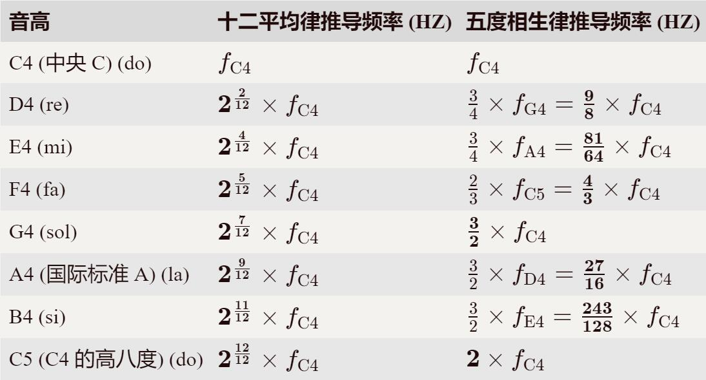
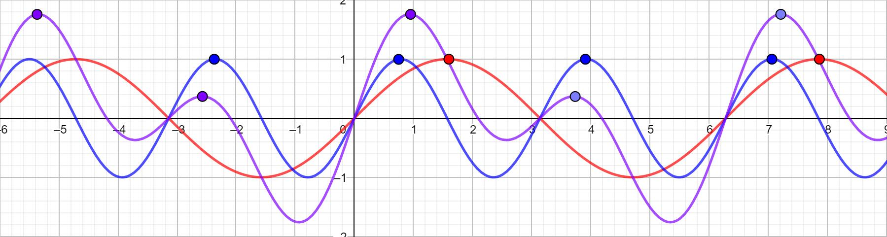
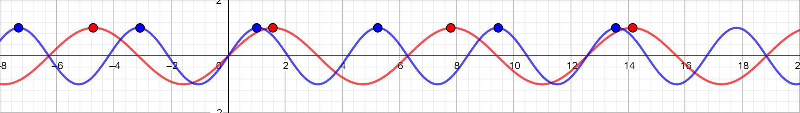
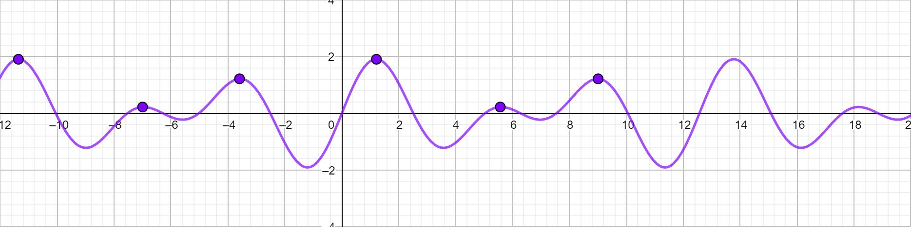
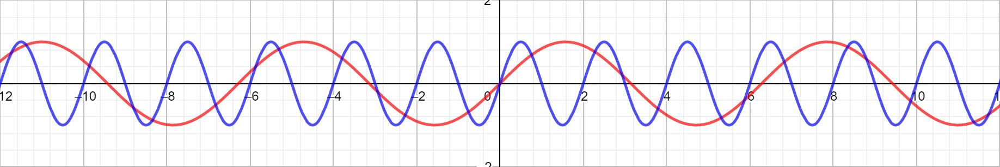
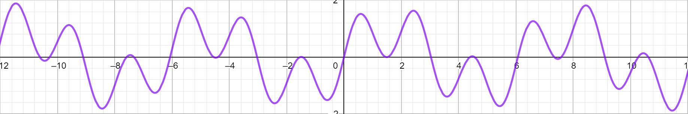

## 1 五度相生律
为了明白和弦与有理数的关系，让我们先看一下五度相生律和十二平均律的关系。十二平均律是钢琴的定音方法，如果你想具体了解十二平均律，[请点这里](https://mp.weixin.qq.com/s/c-T5xCjWPipx0MDP_UA3cg)。根据十二平均律，我们知道如果已知中央 C 的振动频率 $f_{\text{C4}} \approx 261.63$ Hz，那么就可以推出所有音的振动频率。而五度相生律的做法是根据 C4 的振动频率，按照三分损益法递推出一个八度内的 7 个大调音。下面的表格展示了十二平均律和五度相生律的推导方法。

<!-- | 音高 | 十二平均律推导频率 (Hz) | 五度相生律推导频率 (Hz) |
| - | - | - |
| C4 (中央 C) (do) | $f_{\text{C4}}$ | $f_{\text{C4}}$ |
| D4 (re) | $\boldsymbol{2^{\frac{2}{12}}} \times f_{\text{C4}}$ | $\frac{3}{4} \times f_{\text{G4}} = \boldsymbol{\frac{9}{8}} \times f_{\text{C4}}$ |
| E4 (mi) | $\boldsymbol{2^{\frac{4}{12}}} \times f_{\text{C4}}$ | $\frac{3}{4} \times f_{\text{A4}} = \boldsymbol{\frac{81}{64}} \times f_{\text{C4}}$ |
| F4 (fa) | $\boldsymbol{2^{\frac{5}{12}}} \times f_{\text{C4}}$ | $\frac{2}{3} \times f_{\text{C5}} = \boldsymbol{\frac{4}{3}} \times f_{\text{C4}}$ |
| G4 (sol) | $\boldsymbol{2^{\frac{7}{12}}} \times f_{\text{C4}}$ | $\boldsymbol{\frac{3}{2}} \times f_{\text{C4}}$ |
| A4 (国际标准 A) (la) | $\boldsymbol{2^{\frac{9}{12}}} \times f_{\text{C4}}$ | $\frac{3}{2} \times f_{\text{D4}} = \boldsymbol{\frac{27}{16}} \times f_{\text{C4}}$ |
| B4 (si) | $\boldsymbol{2^{\frac{11}{12}}} \times f_{\text{C4}}$ | $\frac{3}{2} \times f_{\text{E4}} = \boldsymbol{\frac{243}{128}} \times f_{\text{C4}}$ |
| C5 (C4 的高八度) (do) | $\boldsymbol{2^{\frac{12}{12}}} \times f_{\text{C4}}$ | $\boldsymbol{2} \times f_{\text{C4}}$ | -->

* 十二平均律递推顺序为：递推顺序为：C4 → D4 → E4 → F4 → G4 → A4 → B4
* 五度相生律递推顺序为：正推部分 C4 → G4 → D4 → A4 → E4；倒推部分 C5 → F4

仔细对比上面两个表中，由十二平均律推出的频率和由五度相生律推出的频率，他们在数值上是非常近似的。
$$
\begin{cases}
    2^{\frac{2}{12}} \approx 1.122 & \frac{9}{8} \approx 1.125 \\
    2^{\frac{4}{12}} \approx 1.260 & \frac{81}{64} \approx 1.266 \\
    2^{\frac{5}{12}} \approx 1.335 & \frac{4}{3} \approx 1.333 \\
    2^{\frac{7}{12}} \approx 1.498 & \frac{3}{2} \approx 1.500 \\
    2^{\frac{9}{12}} \approx 1.682 & \frac{27}{16} \approx 1.688 \\
    2^{\frac{11}{12}} \approx 1.888 & \frac{243}{128} \approx 1.898 \\
\end{cases}
$$

这是多么的 amazing (神奇) 啊。所以五度相生律和十二平均律推出的振动频率几乎是一样的，未经过训练的人耳很难分辨他们的区别。

## 2 和弦与有理数的关系
结合上面的表格发现，我们听到的音乐中常用的八度和弦，如 C4 + C5，振动频率之比约为 $2$；常用的纯四度和弦，如 C4 + F4，振动频率之比约为 $4/3$；常用的纯五度和弦，如 C4 + G4，振动频率之比约为 $3/2$ ……总结一下发现，两个音的振动频率之比越接近简单的有理数，听上去似乎是越和谐的。

## 3 为什么有理数是和谐的
看看八度和弦（振动频率之比为 $2$）长什么样

其中红色为 $\sin x$，蓝色为 $\sin 2x$，二者叠加构成紫色表示的和弦。也许正是因为频率之比为一个很简单的有理数 $2$，因此你的大脑会发现，蓝色声音每出现两次峰值，红色声音就会出现一次峰值。如果把蓝色峰值记作“嘀”，红色峰值记为“哒”，最终的模式就是“嘀嘀哒-嘀嘀哒……”。当然，另一种可能的猜想是最终紫色表示的和弦声波，最高峰和次高峰也是有规律的出现的，总是“高-低-高-低……”。注意，只有振动频率之比为有理数（能写成两个整数之比）时，才存在这种规律。振动频率之比约接近简单的有理数，大脑越容易发现这种规律（周期短）。而如果振动值比不接近较简单的有理数，那么大脑就很难发觉规律（周期过长或非周期）。

让我们再看看五度和弦（振动频率之比为 $3/2$）长什么样：

按照第一种猜想，大脑会察觉到“嘀哒嘀嘀哒-嘀哒嘀嘀哒……”的模式。

而按照第二种猜想，大脑会察觉到“高-低-中-高-低-中……”的模式。

而如果振动频率之比离简单有理数差太多，我们的大脑就很难发现这种规律了：

